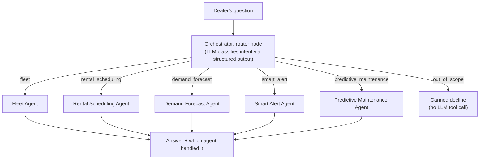

# AI Multi-Agent Assistant

`backend/app/agents/` — a LangGraph-orchestrated multi-agent system, powered by Groq (`llama-3.3-70b-versatile`). Exposed to the dealer as a natural-language chat tab, backed by `POST /api/agent/query`.

## Why an orchestrator + specialists, not one big agent

A single agent with 15 tools tends to pick the wrong tool or reason poorly about which domain a question belongs to. Splitting into five narrowly-scoped specialists — each with only the 2–5 tools relevant to its job — makes tool selection far more reliable, and each specialist's system prompt can be specific instead of trying to cover everything.

## The orchestrator

`orchestrator.py` — a `langgraph.graph.StateGraph` with a router node that uses `with_structured_output()` against a Pydantic model (a `Literal` of the 6 possible routes) to classify the question, then dispatches to exactly one specialist node.

The 6th route, `out_of_scope`, exists specifically because early testing showed that force-routing *every* question into a specialist caused off-topic questions ("what is BFS?") to get answered anyway — the agent would call a tool that had nothing to do with the question and hallucinate a plausible-sounding but wrong answer (once literally answering a computer-science question with a bulldozer ranking). The `out_of_scope` route returns a fixed decline message without invoking any LLM tool call at all.

## The five specialists

Each is a `langgraph.prebuilt.create_react_agent` bound to its own tool subset from `tools.py`. **All tools are read-only / advisory** — no agent can create, modify, or delete a rental, customer, or equipment record. This is deliberate: an LLM tool-calling mistake should never be able to corrupt data.

### Fleet Agent
Equipment status, live location, geofence compliance, and proximity questions.

| Tool | Purpose |
|---|---|
| `get_fleet_overview` | Total/available/rented/overdue/unassigned counts |
| `get_equipment_status` | Full live status for one equipment code |
| `list_geofence_violations` | Every equipment currently outside its designated coordinates |
| `search_equipment` | Partial match on code/type/status |
| `find_equipment_near_city` | Haversine distance from a named Indian city (Bangalore, Chennai, Mumbai, Delhi, Hyderabad, Pune, Kolkata, Ahmedabad, Jaipur, Kochi) — the tool that fixed the "vehicles near Bangalore" bug, which previously had no matching tool at all |

### Rental Scheduling Agent
Availability, rental history, overdue returns. **Explicitly advisory** — its system prompt tells it to recommend equipment and history, then direct the dealer to complete any actual booking in the Rentals & QR tab themselves.

| Tool | Purpose |
|---|---|
| `check_availability` | Available equipment, optionally filtered by type/site |
| `get_rental_history` | Past + active rentals for one equipment |
| `get_overdue_rentals` | Current overdue / due-soon notifications |

### Demand Forecast Agent
Which equipment types are needed where, and concrete pre-positioning actions.

| Tool | Purpose |
|---|---|
| `get_demand_forecast` | Ranked demand by site/type from historical rental volume |
| `get_prepositioning_recommendations` | Cross-references current fleet state against the ranking — recommends a *specific* unit to move to a *specific* site and states when it's free (or reports the fleet is already well-positioned) |

### Smart Alert Agent
Current alerts and on-demand anomaly scans.

| Tool | Purpose |
|---|---|
| `get_active_alerts` | Current notification feed, filterable by severity/type |
| `run_anomaly_scan` | Fresh full-fleet anomaly scan |
| `check_geofence_for_equipment` | Compliance check for one specific equipment |

### Predictive Maintenance Agent
Risk scoring with cited reasons — never a bare number.

| Tool | Purpose |
|---|---|
| `get_maintenance_risk` | 0–100 risk score + reasons for one equipment |
| `get_high_risk_equipment` | Top-N by risk, highest first |

## A subtle bug worth knowing about: empty-list tool results

Groq rejects a tool-call response whose content serializes to an empty array (`400: content : minimum number of items is 1`). Since "no anomalies right now" or "no geofence violations" are common, *correct* outcomes, every tool in `tools.py` returns a wrapping dict (`{"count": 0, "anomalies": []}`) rather than a bare list — never `[]` directly. If you add a new tool, keep this pattern; a bare list return will intermittently 400 the whole conversation turn whenever the real answer happens to be empty.

## Example queries and expected routing

| Question | Routes to |
|---|---|
| "Give me a fleet overview" | Fleet Agent |
| "How many vehicles are around Chennai?" | Fleet Agent |
| "What backhoes are available at S011?" | Rental Scheduling Agent |
| "Are there any overdue rentals?" | Rental Scheduling Agent |
| "Which equipment types are most needed at S009?" | Demand Forecast Agent |
| "Where should I preposition equipment?" | Demand Forecast Agent |
| "What alerts are currently active?" | Smart Alert Agent |
| "What equipment needs maintenance soon?" | Predictive Maintenance Agent |
| "What is BFS?" / "Write me a poem" | `out_of_scope` — polite decline |
