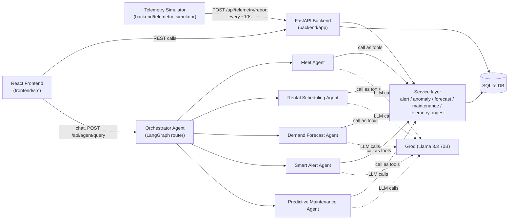

# Architecture

## System overview

Three independent processes make up a full local deployment:

1. **Backend** (`backend/app`) — FastAPI + SQLAlchemy + SQLite. Owns the database, all business rules, and the AI agent layer.
2. **Frontend** (`frontend/src`) — React + TypeScript + Vite. The dealer-facing dashboard, talks to the backend only over REST.
3. **Telemetry simulator** (`backend/telemetry_simulator`, feature-branch only) — a standalone script that POSTs realistic live data to the backend, standing in for real IoT hardware. See [TELEMETRY_SIMULATOR.md](TELEMETRY_SIMULATOR.md).

## Backend design principle: routes → services → (routes | agent tools)

Every piece of business logic — overdue detection, anomaly rules, demand forecasting, maintenance risk scoring, telemetry ingestion — lives in `backend/app/services/*.py` as a plain, testable function that takes a DB session and returns data. Nothing route-specific or agent-specific is baked into it.

- **REST routes** (`backend/app/routers/*.py`) call these functions directly and return the result.
- **AI agent tools** (`backend/app/agents/tools.py`) call the *exact same* functions, wrapped as LangChain tools.

This means a rule is defined once. If `anomaly_service.detect_anomalies_for_equipment()` changes, both the `/api/anomalies` endpoint and the Smart Alert Agent's `run_anomaly_scan` tool pick up the change automatically.

| Service module | Owns |
|---|---|
| `alert_service.py` | Overdue / due-soon rental detection |
| `anomaly_service.py` | Rule-based anomaly detection + geofence compliance check |
| `forecast_service.py` | Demand ranking by site/type + pre-positioning recommendations |
| `maintenance_service.py` | Explainable 0–100 predictive maintenance risk scoring |
| `telemetry_ingest.py` | Applies one incoming telemetry reading to an equipment row |
| `simulator.py` | **Not** the telemetry simulator — this is the backend's lightweight internal safety-net job that re-runs alert/anomaly/maintenance checks every 30s regardless of whether external telemetry is arriving. Confusingly similar name to the `telemetry_simulator/` package; see the note in [TELEMETRY_SIMULATOR.md](TELEMETRY_SIMULATOR.md). |

## Database schema

SQLite via SQLAlchemy, written to be Postgres-compatible for a future production deploy. All tables live in `backend/app/models.py`.

| Table | Purpose |
|---|---|
| `dealers` | Single hardcoded dealer login (hackathon-scope auth) |
| `customers` | Renters — created by the dealer as part of the rental flow, never pre-existing |
| `sites` | Named locations (real Indian cities) with lat/lng centroids |
| `equipment` | The fleet — type, live status, live GPS, fuel/runtime/idle hours, engine health, assigned customer/site |
| `equipment_tenure` | Per-equipment **designated** ("home") coordinates + how long it's been deployed there — the geofence reference point, decoupled from the shared site centroid |
| `rentals` | One row per rental lifecycle: created → checked out (active) → checked in (completed), with the generated QR code |
| `payments` | Stub table — out of scope for this MVP |
| `telemetry` | Raw time-series log of every ingested reading (lat/lng/fuel/status/engine hours/idle hours + timestamp) |
| `usage_logs` | Historical per-day usage records (seeded from the CSV dataset) |
| `notifications` | The unified alert feed — overdue, due-soon, anomaly, and maintenance-risk entries, each with severity + recommended action |
| `forecasts` | Cached output of the last demand-forecast run |
| `agreements` | Stub table — document storage out of scope for this MVP |

Key relationship worth understanding: **`Equipment.status`** (available/rented/overdue) is the *rental/business* status. It is completely separate from the telemetry simulator's internal *engine operating state* (RUNNING/IDLE/OFF/MAINTENANCE) — the backend has no concept of the latter at all. See [TELEMETRY_SIMULATOR.md](TELEMETRY_SIMULATOR.md) for why that distinction matters.

## Data flow: a rental, start to finish

1. Dealer opens **Rentals & QR** → sees live availability (equipment with `status = "available"`).
2. Dealer creates a **new** customer record (the flow requires this — no picking from an existing customer list).
3. `POST /api/rentals` creates the rental (`status = "created"`) and generates a QR code.
4. The frontend immediately calls `POST /api/rentals/{id}/checkout` (auto-checkout — no second manual click), which sets `equipment.status = "rented"` and `rental.status = "active"`.
5. From here on, every telemetry reading POSTed for that equipment code updates its live GPS/fuel/hours, and the backend re-runs overdue/anomaly/maintenance checks on every update.
6. When the equipment is returned, `POST /api/rentals/{id}/checkin` closes the rental out (`status = "completed"`) and frees the equipment back to `available`.

## Data flow: live telemetry

1. `telemetry_simulator` bootstraps its fleet state once from `GET /api/equipment` (or resumes from its own local snapshot file).
2. Every ~10s per machine, it computes a new reading using physics-based rules (not random jitter) and occasionally injects a realistic event (low fuel, overheating, geofence violation, etc).
3. It `POST`s that reading to `/api/telemetry/report`.
4. The backend updates the `equipment` row, inserts a `telemetry` row, and re-runs `alert_service`, `anomaly_service`, and `maintenance_service` — so the dashboard and AI agents are always working off current data, not a stale snapshot.

## Frontend structure

`frontend/src/`:

- `pages/LoginPage.tsx`, `pages/DashboardPage.tsx` — top-level routes
- `components/FleetOverview.tsx` — the dealer-facing "what's out, what's available, what's due back" summary (the primary landing view)
- `components/AssetMap.tsx` — Leaflet map, auto-fits bounds to the whole fleet, color-codes markers by geofence compliance
- `components/AssetTable.tsx` — full per-vehicle detail table
- `components/RentalsPanel.tsx` — the 2-step check-availability → create-customer → QR rental flow
- `components/SummaryCharts.tsx` — Recharts utilization/fuel/revenue analytics
- `components/AlertsPanel.tsx` — the unified notification feed
- `components/ForecastPanel.tsx` — demand forecast ranking
- `components/AgentChat.tsx` — the AI Assistant chat UI, badges each reply by which specialist agent answered
- `components/Header.tsx`, `components/ui.tsx` — shared chrome and primitives
- `api.ts` — every backend call, one function per endpoint
- `types.ts` — TypeScript interfaces mirroring the backend's Pydantic schemas
