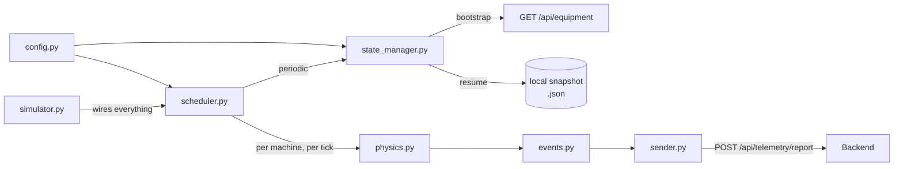

# Telemetry Simulator

> **Branch note:** this package (`backend/telemetry_simulator/`) exists on the `feature/realtime-telemetry-simulator` branch. It is not part of `master` unless/until that branch is merged.

## What this is for

The platform has no real excavators with real GPS/telematics hardware. Without something generating live data, the dashboard, alerts, and AI agents would all be working off frozen seed data forever. This package is a standalone program that behaves like 10 real field devices — it POSTs realistic, physically-plausible telemetry to the backend's public API on an interval, exactly like real hardware would, so the rest of the platform (anomaly detection, alerts, predictive maintenance, the AI assistant) has real, changing data to react to.

It is architected so the backend genuinely cannot tell the difference between this simulator and real hardware — same endpoint, same payload shape. Swapping in real devices later means pointing them at the same URL and turning this off; nothing else in the system changes.

**Naming note:** don't confuse this with `backend/app/services/simulator.py` — that's an unrelated, much smaller module (the backend's internal 30-second safety-net job that re-runs alert/anomaly/maintenance checks). This document is about the `telemetry_simulator/` *package*.

## Running it

Must be run as a module (every file uses relative imports):

```bash
cd backend
python -m telemetry_simulator.simulator
```

Common overrides:
```bash
python -m telemetry_simulator.simulator --interval 5 --machines 5 --log-level DEBUG
python -m telemetry_simulator.simulator --no-gps --no-events   # physics only, no anomalies
```

State persists between restarts in `backend/telemetry_simulator_state.json` (gitignored). Delete it to force a fresh bootstrap from the backend's current data. Stop with `Ctrl+C` — it finishes the in-flight tick and saves before exiting.

## Module-by-module



| Module | Responsibility |
|---|---|
| `config.py` | Every tunable constant — timing, feature flags, and per-domain physics rates/thresholds — as an immutable, env-driven Pydantic model |
| `machine.py` | `MachineState` (bounds-enforced on every field mutation) + `OperatingState` enum (`RUNNING`/`IDLE`/`OFF`/`MAINTENANCE`) |
| `physics.py` | Pure per-field update functions: fuel/hours strictly monotonic; temperature/battery/hydraulic pressure/RPM drift toward a state-dependent target (no jittery jumps); GPS moves along a slowly-drifting heading |
| `events.py` | Duty-cycle state transitions + 6 anomaly events + 2 recovery events, each cooldown-gated so they read as occasional, not spammy |
| `state_manager.py` | Bootstraps from the real backend on first run, persists a crash-safe local snapshot (atomic write) afterward |
| `sender.py` | The only module aware of HTTP — builds the outgoing payload and POSTs with retry/backoff, never raises |
| `scheduler.py` | One independent, jittered `asyncio` task per machine + a periodic snapshot-saving task, with graceful shutdown |
| `simulator.py` | CLI entrypoint wiring everything together |

## Why it looks like a real fleet, not random noise

- **Continuity, not amnesia** — every tick starts from the machine's last known state, never a fresh random draw.
- **Monotonic fields stay monotonic** — engine/runtime/idle hours only ever increase; fuel only ever decreases (except via an explicit `Refuel` event).
- **Independent, jittered clocks** — each machine is its own `asyncio` task on its own timer; they never tick in lockstep, exactly like real devices that don't share a clock.
- **Rare events are rare because of cooldowns, not luck** — a naive "1% chance per tick" event still fires constantly across 10 machines over thousands of ticks. Cooldown-gated events fire, then go quiet for a realistic recovery window.
- **Duty cycles** — machines cycle `OFF → RUNNING → IDLE → RUNNING → OFF` over time rather than running permanently.
- **GPS is a walk, not a teleport** — position updates as `current + step(heading)`, with heading itself drifting slowly, so a plotted path looks like an actual vehicle moving, not a scatter of random points.

## Machine states vs. rental status

`OperatingState` (`RUNNING`/`IDLE`/`OFF`/`MAINTENANCE`) is this simulator's own concept of whether the engine is on — it has **no equivalent field in the backend**. The backend's `Equipment.status` (`available`/`rented`/`overdue`) is the rental/business status and is never touched by the simulator. A real telematics device wouldn't know or care what your rental business is doing with the machine either — this mirrors that.

## Events reference

| Event | Trigger | Effect |
|---|---|---|
| `LowFuel` | `fuel_level` crosses below `FUEL_LOW_THRESHOLD_PCT` | Logged warning, cooldown-gated re-reminders |
| `Overheating` | `engine_temperature` exceeds `OVERHEATING_THRESHOLD_C` | Logged critical |
| `MaintenanceRequired` | `engine_health` drops below `MAINTENANCE_REQUIRED_THRESHOLD_PCT` | Transitions to `MAINTENANCE` state |
| `Refuel` | Probabilistic, more likely the emptier the tank | The *only* path fuel ever increases |
| `MaintenancePerformed` | Probabilistic, after a minimum time in `MAINTENANCE` | Restores engine health, returns to `OFF` — the *only* path health ever increases |
| `GeofenceViolation` | Rare, probabilistic | Places the machine well outside its designated radius from home |
| `UnexpectedMovement` | Rare, probabilistic, only while `OFF`/`MAINTENANCE` | Moves the machine while it should be stationary |
| `SensorFailure` | Rare, probabilistic | Corrupts one *self-correcting* field (temperature/RPM/hydraulic pressure/battery — never fuel or the hour counters, since those don't self-heal the same way) for one tick |

## Configuration reference

Everything in `config.py` is overridable via environment variable or `backend/.env` (same file the backend's Groq key lives in). A few of the most relevant:

| Variable | Default | Meaning |
|---|---|---|
| `BACKEND_BASE_URL` | `http://127.0.0.1:8000` | Backend to POST to |
| `UPDATE_INTERVAL_SECONDS` | `10.0` | Nominal seconds between updates per machine |
| `UPDATE_JITTER_SECONDS` | `2.0` | Random +/- jitter so machines never sync |
| `NUMBER_OF_MACHINES` | `10` | Cap on fleet size to simulate |
| `ENABLE_GPS_MOVEMENT` | `true` | Master switch for GPS drift |
| `ENABLE_FAILURE_EVENTS` | `true` | Master switch for the 6 anomaly events |
| `ENABLE_RECOVERY_EVENTS` | `true` | Master switch for Refuel/MaintenancePerformed |
| `ENABLE_STATE_TRANSITIONS` | `true` | If false, every machine stays in its bootstrap state forever |
| `STATE_SNAPSHOT_PATH` | `telemetry_simulator_state.json` | Local persistence file |

Full list, including every physics rate/threshold, is in `config.py`'s `SimulatorConfig` — every field has an inline docstring.

## Known limitations (by design, documented tradeoffs)

These aren't bugs — they're deliberate compromises made explicit rather than hidden, because the live `/api/telemetry/report` endpoint's contract is narrower than the simulator's internal model:

1. **`fuel_usage` unit mismatch.** The backend's field has historically meant litres/day; the simulator's internal `fuel_level` is a 0–100% gauge. `sender.py` writes the percentage directly into `fuel_usage` as a stopgap, since that's the only fuel slot available. Flagged in `sender.py`, `state_manager.py`, and here.
2. **`engine_temperature`, `battery_voltage`, `hydraulic_pressure`, `rpm` are computed but never sent.** The live endpoint has no fields for them yet.
3. **`OperatingState` is never sent.** A `MaintenancePerformed` event genuinely restores the simulator's internal engine health, but the dashboard's `engine_health` column won't reflect it, because that field isn't in the current POST contract either — only `fuel_usage`, `runtime_hours`, `idle_hours`, `lat`, `lng` are transmitted.

**To close these gaps:** add `engine_temperature`, `battery_voltage`, `hydraulic_pressure`, `rpm`, `operating_state`, and a proper `fuel_level` (0–100%) column to the `Equipment` model and `TelemetryReport` schema, then extend `sender.build_payload()` and `telemetry_ingest.report_telemetry()` to carry them through. Everything the simulator needs on the sending side already exists — this is purely backend/schema work.

## Verification performed

Every module in this package was tested individually against the real running backend (not mocks) before being committed — bootstrap correctness, physics invariants (fuel/hours monotonicity, bounds under large time jumps), every event/transition path with boosted probabilities, snapshot save/resume/corruption-recovery, retry/backoff behavior, and a full end-to-end scheduler run confirming staggered (non-lockstep) POSTs and a graceful shutdown that always finishes an in-flight send before exiting.
